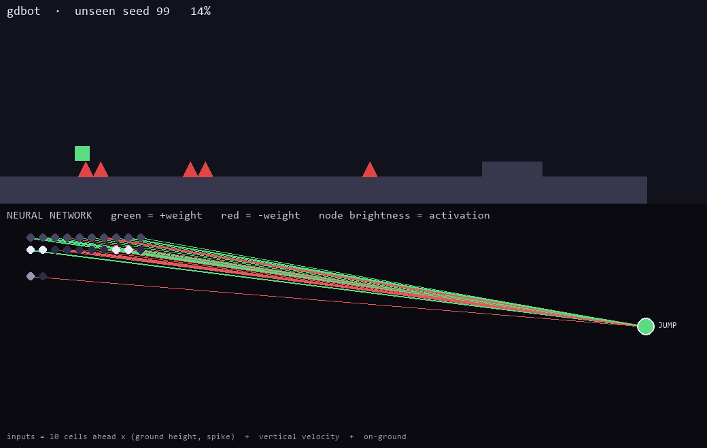

<p align="center">
  
</p>
<p align="center"><em>Live capture: the neural network (bottom) reacts to upcoming spikes and fires the JUMP node to clear them (top).</em></p>

# gdbot — a bot that learns to play Geometry Dash

A neural network that learns to play Geometry Dash (GD 2.2), inspired by
[MarI/O](https://github.com/rahulk64/Mar-IO). It uses **NEAT** (NeuroEvolution of
Augmenting Topologies) to evolve networks that react to upcoming hazards and jump —
the goal is a *reactive generalist* that can attempt many levels, not a memorized
macro for one.

See [`plan`](.) for the full architecture and roadmap.

## How it's built

One environment interface, two interchangeable backends:

<p align="center">
  
</p>

The learning code only ever talks to `GDEnv`, so training against the fast
deterministic simulator now and the real game later needs **no change** to the
network. Observations are a lookahead window of upcoming ground/spikes plus the
player's velocity and on-ground flag — the same layout for Sim and Live.

## Quick start (no game needed)

```bash
pip install -r requirements.txt

python train.py 100      # evolve for 100 generations -> winner.pkl + fitness.png
python play.py 99        # watch the trained bot play an UNSEEN course (seed 99)

# MarI/O-style view: the game on top, the live neural network below
python watch.py play 99  # the trained bot + its network firing in real time
python watch.py learn    # evolve from scratch and WATCH it improve generation by generation
```

`train.py` scores each genome across five different courses (seeds 1–5) so the
network is rewarded for *reacting* to what it sees, not memorizing one layout.
`play.py`/`watch.py play` run seed 99 — a course never trained on — to show it
generalizes. `watch.py learn` shows the whole evolutionary process visually:
early networks die instantly, then get further, then clear the course. In the
network panel, green/red lines are positive/negative connection weights and
nodes brighten with activation (spike cells light up just before it jumps).

## Project layout

| Path | What it is |
|---|---|
| `gdbot/env_base.py` | `GDEnv` — the Gym-style interface both backends implement |
| `gdbot/sim_env.py` | `SimEnv` — deterministic headless cube simulator (physics + course generator) |
| `gdbot/game_state.py` | backend-agnostic per-frame state schema |
| `gdbot/observation.py` | GameState → network input vector (`OBS_SIZE`) |
| `gdbot/neat_core.py` | NEAT evaluation + training loop |
| `gdbot/netviz.py` | MarI/O-style live network renderer |
| `gdbot/live_shared.py` | read live GD state from the Geode bridge (shared memory) |
| `geode-mod/` | **GDBot Bridge** — Geode mod streaming state & applying jump actions |
| `neat_config.txt` | NEAT hyperparameters (`num_inputs` must equal `OBS_SIZE`) |
| `train.py` / `play.py` / `watch.py` | train / replay / watch (game + live network) |

## Reading the real game (Phase 2)

GD 2.2 on Windows is a **64-bit** process with no reliable public memory offsets,
so instead of raw pointer chases we read state through a small **Geode mod**
([`geode-mod/`](geode-mod/)). Geode resolves class member offsets per version, so
we get exact `PlayLayer`/`PlayerObject` state (and frame-perfect control via
`pushButton`) with no version-pinned addresses. The mod writes state to a named
shared-memory block every physics frame; Python reads it via `gdbot/live_shared.py`.

Setup + build steps are in [`geode-mod/README.md`](geode-mod/README.md). Once the
mod is installed and GD is in a level:

```bash
python -m gdbot.live_shared   # live x / y / % / mode / dead from the game
```

## Roadmap

- **Phase 1 (done):** SimEnv + NEAT — prove the network learns, offline.
- **Phase 2 (in progress):** `geode-mod/` Geode bridge + `gdbot/live_shared.py` — read/control real GD.
- **Phase 3:** `live_env.py` — wrap the bridge as a `GDEnv` so the trained brain drives the game.
- **Phase 4:** `level_parser.py` — build the real level's hazard grid for lookahead.
- **Phase 5:** train on real levels; add speedup + more gamemodes (ship/wave/…).
- **Phase 6:** PPO/DQN path via the same `GDEnv`.

## Guardrails

This is a **local, single-player research project**, in the same spirit as MarI/O.
- Do **not** submit bot completions to Geometry Dash's online servers or
  leaderboards — that cheats the community and likely violates the game's terms.
- Memory reading and input injection target your own local game process only.
