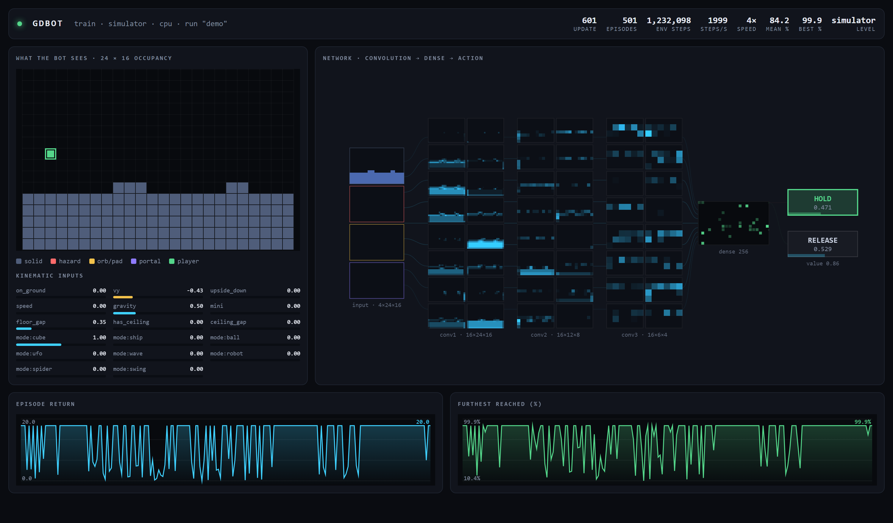
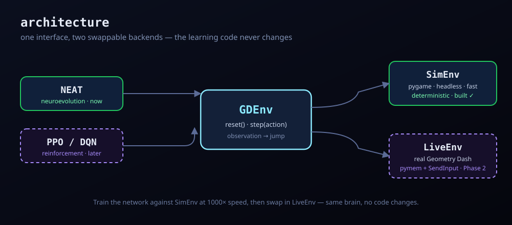
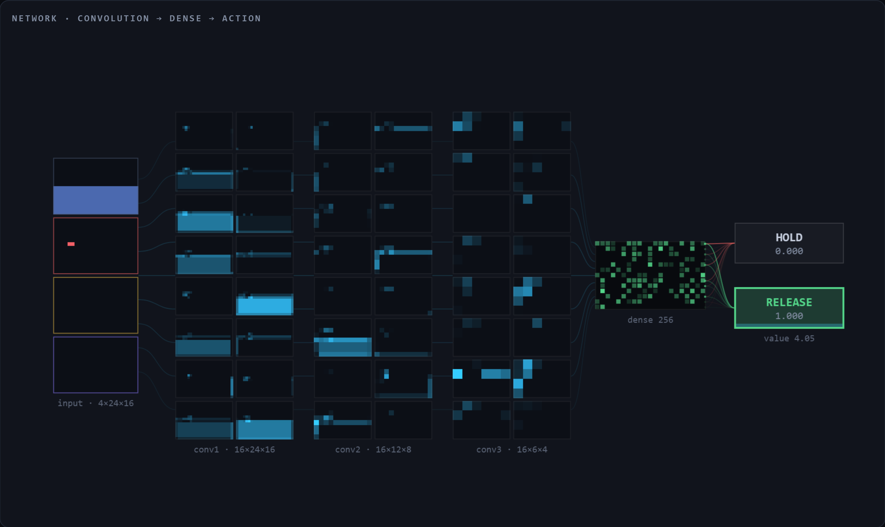
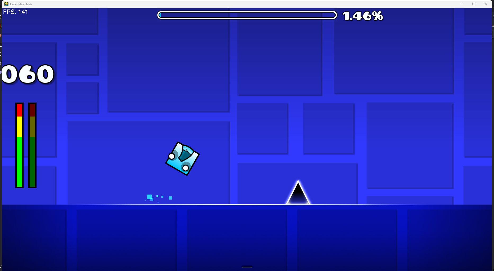

# gdbot — a bot that learns to play Geometry Dash

<p align="center">
  
</p>
<p align="center"><em>The live viewer, mid-training. Left: what the bot actually sees. Right: the same frame flowing through the network to a decision.</em></p>

A neural network that learns to play **Geometry Dash 2.2**, in the spirit of
[MarI/O](https://github.com/rahulk64/Mar-IO). A convolutional policy reads a grid
of what is coming toward the player and decides, sixty times per second of game
time, whether to hold jump. The goal is a **reactive generalist** — something that
plays levels it has never seen — not a memorised macro for one level.

<p align="center">
  
</p>

## Quick start

```bash
pip install -r requirements.txt

python train.py --sim              # train against the simulator — no game needed
python train.py --level 1          # train on real GD (Stereo Madness)
python train.py --play runs/gd/best.pt --speed 1    # watch it play, no learning
```

Either way it prints a URL. Open it and the network appears; close the tab and
training goes straight back to full speed.

```
┌─ gdbot ─────────────────────── train · simulator · cuda · run "gd" ─┐
│  WHAT THE BOT SEES · 24 × 16     NETWORK · conv → dense → action    │
│  ┌──────────────────────────┐                                      │
│  │......!......#............│    ▓▓  ▓▓  ▓▓  ▓▓        ╱────────╮   │
│  │......!......#............│    ▓▓  ▓▓  ▓▓  ▓▓  ═══╤══▶  HOLD  │   │
│  │..@...!......######.......│    ▓▓  ▓▓  ▓▓  ▓▓     │  ╰────────╯   │
│  │##########################│  input c1  c2  c3   dense    p=0.87   │
│  └──────────────────────────┘                                       │
│  ▁▂▃▅▆▇ episode return        ▁▁▂▄▆▇ furthest reached (%)            │
└─────────────────────────────────────────────────────────────────────┘
```

## How it works

**Perception.** A [Geode mod](geode-mod/) inside the game hooks
`PlayLayer::postUpdate` and writes a **24 × 16 × 4** occupancy grid every frame —
solid, hazard, orb/pad, portal — covering two cells behind the player and
twenty-one ahead. Objects are bucketed into a per-level column index, so a frame
scans about 24 buckets instead of every object in the level.

**Control.** Python answers each frame with hold-or-release through a pair of
named events. The mod *blocks* until the answer arrives, which is what lets the
game run as fast as the agent can think without the agent ever missing a frame.
One answered frame is one fixed `1/step_hz` slice of game time, so raising
`--speed` buys wall-clock throughput and changes nothing the policy experiences.

**The policy.** Three conv layers over the grid, concatenated with 17 kinematic
scalars (velocity, on-ground, gamemode, gravity, mini, floor and ceiling gaps),
into a dense trunk with a policy head and a value head, trained with PPO.

Nothing in the observation says *where in the level* the player is — no x, no
percent. A policy that can read the clock will memorise a level instead of
learning to see it.

<p align="center">
  
</p>
<p align="center"><em>The four input channels (solid · hazard · orb/pad · portal), 16 filters per conv stage, the dense layer, and the two action heads. The red channel is the network isolating a single spike.</em></p>

**The viewer.** The trainer never renders. Each step it calls `should_capture()`,
which is three comparisons and answers `False` unless a browser is actually
connected and a frame is due at viewer framerate. Only then does it pay for
introspection and publish a snapshot — a JSON encode and two assignments, never a
socket write. Two daemon threads serve the page and push the latest frame to
whoever is watching, and a slow browser misses frames instead of slowing training.

## Results

Against the simulator, with **a freshly generated course every episode** so there
is nothing to memorise:

| environment steps | mean % of course | best attempt | policy entropy |
|---|---|---|---|
| 12k | 12.0 | 27.8 | 0.693 *(uniform — still guessing)* |
| 70k | 12.4 | 44.4 | 0.657 |
| 456k | 80.6 | 99.9 | 0.472 |
| 743k | 86.5 | 99.9 | 0.456 |

Roughly 1 850 steps/s on CPU with no viewer attached. `python report.py <run>`
turns a run's CSV logs into `runs/<run>/report.pdf` — learning curve, PPO health
diagnostics, and the distribution of individual attempts.

## Project layout

| Path | What it is |
|---|---|
| `geode-mod/` | **GDBot Bridge** — the Geode mod: perception, control, speed, commands |
| `gdbot/bridge.py` | the shared-memory + event protocol, and the frame handshake |
| `gdbot/obs.py` | the observation contract both backends emit |
| `gdbot/env.py` | `GDEnv`, and `LiveEnv` on top of the bridge |
| `gdbot/sim_env.py` | `SimEnv` — same contract, deterministic, no game required |
| `gdbot/policy.py` | the conv actor-critic, and the activations the viewer draws |
| `gdbot/ppo.py` | rollout buffer, GAE, clipped-surrogate update |
| `gdbot/telemetry.py` | the one-way channel to the viewer, off the hot path |
| `viewer/index.html` | the live network view — self-contained, no build step |
| `train.py` | train / resume / play |
| `report.py` | CSV logs → PDF report |
| `tests/` | protocol tests against a fake mod; stack tests against `SimEnv` |

```bash
python tests/test_bridge.py       # the wire protocol, with no game running
python tests/test_stack.py        # obs, policy, PPO and telemetry, end to end
python -m gdbot.bridge --grid     # ASCII view of what the mod is publishing
python -m gdbot.bridge --bench    # throughput and handshake latency by speed
python -m gdbot.sim_env           # same ASCII view, from the simulator
```

Mod setup and build steps are in [`geode-mod/README.md`](geode-mod/README.md).

## Previous approach — NEAT

The project started with NEAT (neuroevolution) over 22 hand-picked numbers: ten
look-ahead columns of `(surface height, spike)` plus velocity and on-ground. Over
an unattended ~80-generation run it learned to jump what it could see and reached
**~19% of Stereo Madness** before plateauing — logs and report in
[`demo/`](demo/).

Two things ended that approach. Those 22 numbers could not represent saw blades,
orbs, pads or portals at all, and NEAT cannot evolve topologies over the 1 536
grid inputs that *can*. The old trainer also drew its network with pygame inside
the decision loop behind a `clock.tick(120)`, so watching it capped training at
120 decisions per second and the redraw ran whether or not anyone was looking.

<p align="center">
  
</p>
<p align="center"><em>The NEAT-era bot driving the real cube through Stereo Madness.</em></p>

## Guardrails

This is a **local, single-player research project**, in the same spirit as MarI/O.

- Do **not** submit bot completions to Geometry Dash's online servers or
  leaderboards — that cheats the community and likely violates the game's terms.
- The mod and the input path target your own local game process only.
