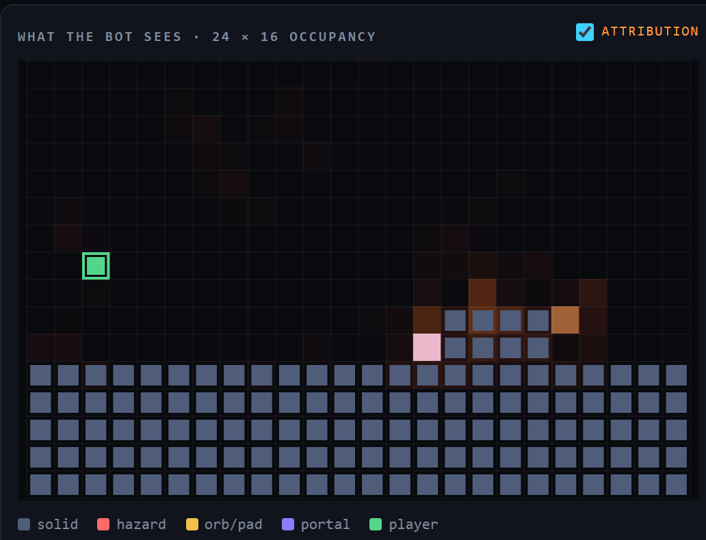
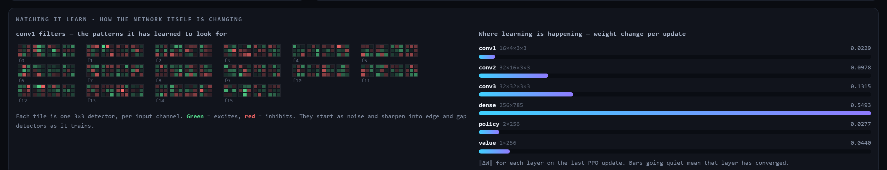

# gdbot — a bot that learns to play Geometry Dash

<p align="center">
  
</p>
<p align="center"><em>The live viewer, mid-training. Left: what the bot actually sees. Right: the same frame flowing through the network to a decision.</em></p>

A neural network that learns to play **Geometry Dash 2.2**, in the spirit of
[MarI/O](https://github.com/rahulk64/Mar-IO). A convolutional policy reads a grid
of what is coming toward the player and decides, sixty times per second of game
time, whether to hold jump. The goal is a **reactive generalist** — something that
plays levels it has never seen — not a memorised macro for one level.

<p align="center">
  
</p>

## Quick start

```bash
pip install -r requirements.txt

python train.py --sim              # train against the simulator — no game needed
python train.py --sim --envs 32    # 32 courses at once — 8x faster, but see below
python train.py --level 1          # train on real GD (Stereo Madness)
python train.py --play runs/gd/best.pt --speed 1    # watch it play, no learning
```

Either way it prints a URL. Open it and the network appears; close the tab and
training goes straight back to full speed.

```
┌─ gdbot ─────────────────────── train · simulator · cuda · run "gd" ─┐
│  WHAT THE BOT SEES · 24 × 16     NETWORK · conv → dense → action    │
│  ┌──────────────────────────┐                                      │
│  │......!......#............│    ▓▓  ▓▓  ▓▓  ▓▓        ╱────────╮   │
│  │......!......#............│    ▓▓  ▓▓  ▓▓  ▓▓  ═══╤══▶  HOLD  │   │
│  │..@...!......######.......│    ▓▓  ▓▓  ▓▓  ▓▓     │  ╰────────╯   │
│  │##########################│  input c1  c2  c3   dense    p=0.87   │
│  └──────────────────────────┘                                       │
│  ▁▂▃▅▆▇ episode return        ▁▁▂▄▆▇ furthest reached (%)            │
└─────────────────────────────────────────────────────────────────────┘
```

## How it works

**Perception.** A [Geode mod](geode-mod/) inside the game hooks
`PlayLayer::postUpdate` and writes a **24 × 16 × 4** occupancy grid every frame —
solid, hazard, orb/pad, portal — covering two cells behind the player and
twenty-one ahead. Objects are bucketed into a per-level column index, so a frame
scans about 24 buckets instead of every object in the level.

**Control.** Python answers each frame with hold-or-release through a pair of
named events. The mod *blocks* until the answer arrives, which is what lets the
game run as fast as the agent can think without the agent ever missing a frame.
One answered frame is one fixed `1/step_hz` slice of game time, so raising
`--speed` buys wall-clock throughput and changes nothing the policy experiences.

**The policy.** Three conv layers over the grid, concatenated with 19 kinematic
scalars (velocity, on-ground, gamemode, gravity, mini, floor and ceiling gaps,
whether the button was already held, and how long the player has been airborne),
into a dense trunk with a policy head and a value head, trained with PPO. 216,979
parameters, of which 93% sit in the single dense layer — see
[the report](docs/mathematical-report.md#22-the-dense-layer-is-93-of-the-parameters-and-19-of-the-arithmetic).

Nothing in the observation says *where in the level* the player is — no x, no
percent. A policy that can read the clock will memorise a level instead of
learning to see it.

`prev_action` is not decoration: GD fires an orb on a **fresh** click and ignores
a held one, so "holding" and "pressing" are different states of the world that
the observation used to render identically. A memoryless policy cannot recover
from an aliased observation no matter how long it trains.

**Two rollout backends, one learner.** Live Geometry Dash is a single environment
stepped inside a frame handshake, so it collects one transition at a time. The
simulator (`gdbot/vec_env.py`) steps N courses as numpy arrays and the policy
decides for all of them in one forward pass. That is worth a lot of wall-clock,
because at batch 1 this network spends **96%** of a decision on Python and
kernel-launch overhead rather than on its own arithmetic (measured: 395 µs per
decision at batch 1, 17.4 µs at batch 128, for identical arithmetic).

| `--envs` | rollout steps/s | speedup | mean % after 245k transitions |
|---|---|---|---|
| 1 | 2,045 | 1.0× | **37.0** [29.0, 44.6] |
| 8 | 9,118 | 4.5× | 14.5 [14.0, 14.9] |
| 32 | 17,210 | 8.4× | 14.7 [14.2, 15.1] |
| 128 | 50,900 | 24.9× | — |

**The speed is real and it is not free.** `--rollout` is a *transition* budget, so
every row of that table trains on the same 245k samples — and at equal samples the
single-environment rollout learns more than twice as well. That is why `--envs`
defaults to 1 rather than to something fast. Three seeds per arm, scored on the
last 400 episodes with a moving-block bootstrap; the intervals do not come close
to overlapping.

The two arms are indistinguishable for the first ~45 updates and diverge after,
which points at *what* the batch contains rather than at a bug: eight parallel
courses decorrelate the batch, and this task seems to want the opposite — a
concentrated run of experience against the one obstacle currently blocking
progress. [The report](docs/mathematical-report.md#7-experiments) has the full
measurement and what it does and does not establish.

There is also a hard ceiling on useful parallelism that is not the hardware: GAE
has an effective horizon of `1/(1-γλ)` ≈ 17 steps, so splitting a rollout into
segments much shorter than that discards the credit it exists to propagate.
`train.py` warns when you cross that line.

<p align="center">
  
</p>
<p align="center"><em>The four input channels (solid · hazard · orb/pad · portal), 16 filters per conv stage, the dense layer, and the two action heads. The red channel is the network isolating a single spike.</em></p>

**What actually drove the decision.** The occupancy grid is overlaid with
*attribution* — |∂ log π(chosen action) / ∂ cell|, the gradient of this frame's
decision with respect to every cell the network can see. Feature maps show what
each filter responds to; attribution shows what the **decision** depended on,
which is the question a human watching actually has. Early in training it smears
across the floor; a policy that has learned to see lights up on the hazard it is
reacting to. It costs one backward pass, and only when a browser is connected.

<p align="center">
  
</p>
<p align="center"><em>A trained policy, mid-jump. The glow sits on the leading edge of the step it is clearing — not on the floor it left, and not on the empty sky.</em></p>

**Watching it learn.** Everything above shows what the network *sees*. A second
row shows how the network itself is *changing*: conv1's kernels — the only layer
whose weights read directly as picture detectors — the per-layer ‖ΔW‖ of the last
PPO update, and the per-layer gradient norm read *before* clipping. ‖ΔW‖ says
where Adam moved; the gradient says where the loss is still pushing, and a conv
stage whose gradient has collapsed is frozen whatever the optimiser does.

**Is any of it working?** Two more panels answer that directly. *Explained
variance* — `1 − Var(return − value) / Var(return)` — is the one cheap number that
separates a critic that has learned something from one that is predicting the
mean return, in which case every advantage is Monte-Carlo noise. The *advantage
distribution* shows the shape of what the policy gradient is actually made of.

<p align="center">
  
</p>
<p align="center"><em>Left: 16 conv1 filters, four 3×3 detectors each — green excites, red inhibits. They start as noise and sharpen as it trains. Middle: how far each layer moved on the last update. Right: where the loss is still pushing, on a log scale.</em></p>

**The viewer.** The trainer never renders. Each step it calls `should_capture()`,
which is three comparisons and answers `False` unless a browser is actually
connected and a frame is due at viewer framerate. Only then does it pay for
introspection and publish a snapshot — a JSON encode and two assignments, never a
socket write. Two daemon threads serve the page and push the latest frame to
whoever is watching, and a slow browser misses frames instead of slowing training.

## Results

### Real Geometry Dash — Stereo Madness

A single unattended run: **7.12 hours, 1.41 M steps, 1 760 attempts**, from a
random policy. It reached **52.4%** — nearly triple the ~19% the NEAT version
plateaued at.

Learning is a staircase. The agent clears an obstacle, piles up against the next
one, then breaks through:

| tenth of the run | mean % | 90th pct % | best % |
|---|---|---|---|
| 1 | 3.6 | 5.5 | 8.9 |
| 4 | 16.5 | 19.5 | 19.5 |
| 7 | 20.9 | 26.7 | 26.8 |
| 10 | **25.0** | **45.3** | **52.4** |

The walls are visible as death clusters: 2–5% (405 deaths), 10–11% (199),
**18–19% (498 — 28% of every attempt)**, 26–27% (127). Entropy fell 0.693 → 0.238.

It had **not** plateaued when the run ended — the 90th percentile was climbing
fastest in the final tenth, and the run was cut short by a bridge stall rather
than by converging. See [`demo/ppo-2026-07-30/`](demo/ppo-2026-07-30/) for the
raw logs and generated report.

#### Replication with the corrected stack (2026-08-07)

The rewritten observation, the per-epoch KL brake, the k3 estimator and λ = 0.99
were taken back to the real game: **2.24 hours, 432 k steps, 732 attempts**. At
equal samples it is **indistinguishable from the run above** — best 19.6% vs
19.5%, final-200 mean 16.1% vs 15.5%, bootstrap intervals overlapping.

What it did settle is *where* the agent is stuck. Both runs die in the same half
percent of level: **26% of every attempt ended between 19.0% and 19.5%** (block
169), and this one never got past 19.6%. Two observation vectors and two credit
horizons converging on the same obstacle makes that a property of the level, not
of the learner.

The most actionable number is a negative one: the **KL early-stop engaged on 0 of
211 updates**, median KL 0.0034 against a 0.03 target. The trust region is not
what bounds the step — the learning rate is, with ~9× headroom unused. Details in
[`demo/ppo-2026-08-07/session-report.md`](demo/ppo-2026-08-07/session-report.md).

### Simulator

With **a freshly generated course every episode**, so there is nothing to memorise:

| environment steps | mean % of course | best attempt | policy entropy |
|---|---|---|---|
| 12k | 12.0 | 27.8 | 0.693 *(uniform — still guessing)* |
| 70k | 12.4 | 44.4 | 0.657 |
| 456k | 80.6 | 99.9 | 0.472 |
| 819k | 84.2 | 99.9 | 0.460 |

It plateaus around 85–89% mean with a 36–48% completion rate, at ~1 850 steps/s
on CPU — **33× the live game's 56 steps/s**, which is the whole argument for
keeping it. `python report.py <run>` turns a run's CSV logs into
`runs/<run>/report.pdf`.

## What the maths says

[`docs/mathematical-report.md`](docs/mathematical-report.md) derives what the
agent is actually optimising from the constants in the code. Three things came
out of it that changed the implementation:

- **The trust-region brake was measuring the wrong average.** The KL early-stop
  compared a mean taken over *every minibatch since the update began*, which
  includes epoch 1's near-zero KL. It engaged when the current epoch had already
  travelled `2E/(E+1)` times the configured target — 1.6× at four epochs, 1.8× at
  eight. It now measures one epoch at a time, and uses the `k₃` estimator, whose
  standard error at the threshold is 1–35% against `k₁`'s 51–83%.
- **GAE cannot span a single jump.** The advantage estimator's horizon is
  `1/(1-γλ)` = 16.8 steps; a cube jump takes exactly 26 steps and covers 4.46
  blocks. The decision to jump and its outcome sit further apart than the
  estimator reaches, which predicts λ ≈ 0.97 should beat the default 0.95. Tested:
  the four arms come out **monotone in the predicted order** (36.1 / 37.0 / 37.8 /
  38.6 for λ = 0.90 / 0.95 / 0.97 / 0.99) — and the 2.5 pp spread sits inside ~7 pp
  of seed noise, so it is suggestive and not resolved. Separating it properly would
  need ~120 seeds per arm.
- **Progress and survival are the same signal.** The player auto-scrolls at a
  fixed speed, so percent is an affine function of time alive. Inside the
  discount horizon the death penalty moves the value function 4.7× more than the
  progress reward does, and the completion bonus discounts to 2×10⁻²² — it is a
  scoreboard, not an incentive.

The report is also honest about what the existing hyperparameter sweep supports:
once episode autocorrelation is accounted for, a 200-episode rolling mean carries
a 95% interval of roughly ±11 pp, so the sweep reliably identifies which settings
are **bad** and barely separates the good ones.

## Running on the real game

Verified live against GD 2.2081 / Geode 5.8.2 on Stereo Madness. The mod loads the
level itself, so you can start from the menu:

```bash
python -m gdbot.bridge --grid     # check perception first — trust this before training
python train.py --level 1         # train on Stereo Madness
```

Measured on the live game, `step_hz=60` (so 60 steps/s is exactly 1x real time):

| `--speed` | steps/s | vs real time | missed frames | handshake p50 |
|---|---|---|---|---|
| 1 | 35 | 0.6x | 0 | 13 µs |
| 2 | 59 | 1.0x | 0 | 10 µs |
| 4 | 60 | 1.0x | 0 | 11 µs |
| 16 | 60 | 1.0x | 0 | 11 µs |

**There is no wall-clock speedup, and `--speed` above 2 does nothing.** Skipping
presents lifts throughput from 0.6x to 1.0x and then it stops dead: GD gates its
own stepping, so `postUpdate` never fires faster however much render work is
skipped (16 `CCScheduler::update` calls were measured to produce exactly one
`postUpdate`). Live training runs at about 1x real time — roughly 50x slower than
the simulator, so develop against `--sim` and use the live game to validate.

Long runs survive interruptions: if the frame stream stalls, `LiveEnv.recover()`
re-attaches, reloads the level if the game left it, and training continues from
where it was. Before that existed, one hitch past the frame timeout ended a
7-hour run that was still improving.

Three known issues, all found by running it:

- **The mod can hang the game, and `--speed 4` is the suspect.** Three times now
  GD has been left alive and `Responding`, burning CPU, with `CCScheduler::update`
  stopped and `state_seq` frozen. Because `attached` stays 1, the in-mod watchdog
  cannot fire and `LiveEnv.recover()` has nothing to re-attach to; only a GD
  restart clears it. The last two occurrences were both at `--speed 4` and it has
  never been seen at `--speed 1`. Since `--speed 4` measured 54.9 steps/s against
  a hard 60 ceiling, it is buying almost nothing for the risk.
- **`fast_respawn` is broken and defaults off.** Skipping GD's death animation
  re-enters the death sequence, so the respawned player dies again immediately —
  an unrecoverable loop that spun the attempt counter past 4000 at 0.00% and left
  the level unusable until the flag was cleared. Deferring the reset to the top of
  the frame and adding a delay cut it to ~9x too many respawns, not zero. The mod
  now also disables the flag itself after 20 respawns that go nowhere, so it
  degrades instead of hanging. GD's own ~1s auto-retry is the reliable path.
- **The game window freezes on a stale frame while an agent is attached.** It is
  still training correctly underneath — collapsing the frame-pacing interval is
  what keeps the handshake in lockstep, and removing it was measured to let the
  render loop free-run at ~240fps with 1650 of every 2250 frames unanswered. Watch
  the viewer instead; it shows what the bot actually sees.

## Project layout

| Path | What it is |
|---|---|
| `geode-mod/` | **GDBot Bridge** — the Geode mod: perception, control, speed, commands |
| `gdbot/bridge.py` | the shared-memory + event protocol, and the frame handshake |
| `gdbot/obs.py` | the observation contract both backends emit |
| `gdbot/env.py` | `GDEnv`, and `LiveEnv` on top of the bridge |
| `gdbot/sim_env.py` | `SimEnv` — same contract, deterministic, no game required |
| `gdbot/vec_env.py` | `VecSimEnv` — N of those as numpy arrays, for batched inference |
| `gdbot/policy.py` | the conv actor-critic, its activations, and input attribution |
| `gdbot/ppo.py` | rollout buffers, GAE, clipped-surrogate update, diagnostics |
| `gdbot/telemetry.py` | the one-way channel to the viewer, off the hot path |
| `viewer/index.html` | the live network view — self-contained, no build step |
| `train.py` | train / resume / play |
| `bench.py` | component benchmarks and the hyperparameter sweep |
| `experiments.py` | the experiments the report cites, with block-bootstrap error bars |
| `report.py` | CSV logs → PDF report |
| `docs/mathematical-report.md` | what the agent optimises, derived — and what that implies |
| `tests/` | protocol tests against a fake mod; stack tests against `SimEnv` |

```bash
python tests/test_bridge.py       # the wire protocol, with no game running
python tests/test_stack.py        # obs, policy, PPO and telemetry, end to end
python -m gdbot.bridge --grid     # ASCII view of what the mod is publishing
python -m gdbot.bridge --bench    # throughput and handshake latency by speed
python -m gdbot.sim_env           # same ASCII view, from the simulator
python -m gdbot.vec_env           # vectorised environment throughput by batch size
python experiments.py lam         # reproduce the GAE-horizon experiment

python bench.py components        # where the per-decision budget goes (~2 min)
python bench.py sweep             # hyperparameter sweep in the simulator (~18 min)
```

`bench.py sweep` runs the real trainer as a subprocess per config, so it measures
the shipping code path. The last sweep's finding: **at a fixed sample budget,
everything that buys more gradient steps per sample wins** — lr 1e-3 (65.5% mean),
8 epochs (63.2%) and rollout 512 (59.6%) all beat the 3e-4 / 4-epoch / 2048
defaults (48.3%), and the three worst configs are all "optimise less". Full
results and caveats in
[`demo/ppo-2026-07-30/session-report.md`](demo/ppo-2026-07-30/session-report.md).

Mod setup and build steps are in [`geode-mod/README.md`](geode-mod/README.md).

## Previous approach — NEAT

The project started with NEAT (neuroevolution) over 22 hand-picked numbers: ten
look-ahead columns of `(surface height, spike)` plus velocity and on-ground. Over
an unattended ~80-generation run it learned to jump what it could see and reached
**~19% of Stereo Madness** before plateauing — logs and report in
[`demo/`](demo/).

Two things ended that approach. Those 22 numbers could not represent saw blades,
orbs, pads or portals at all, and NEAT cannot evolve topologies over the 1 536
grid inputs that *can*. The old trainer also drew its network with pygame inside
the decision loop behind a `clock.tick(120)`, so watching it capped training at
120 decisions per second and the redraw ran whether or not anyone was looking.

<p align="center">
  
</p>
<p align="center"><em>The NEAT-era bot driving the real cube through Stereo Madness.</em></p>

## Guardrails

This is a **local, single-player research project**, in the same spirit as MarI/O.

- Do **not** submit bot completions to Geometry Dash's online servers or
  leaderboards — that cheats the community and likely violates the game's terms.
- The mod and the input path target your own local game process only.
